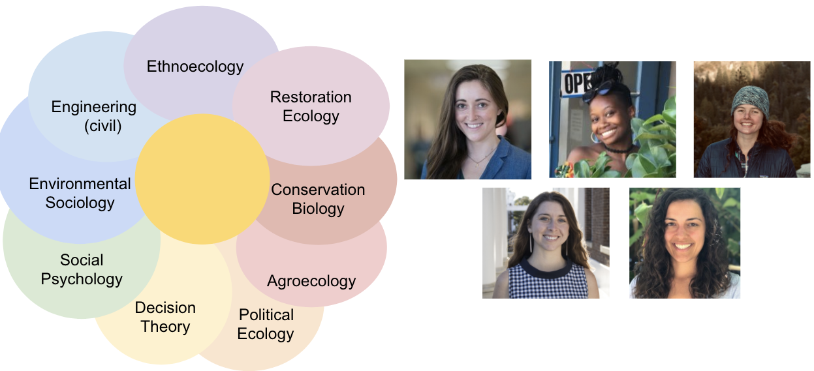

# Using Decision Making Models to Design Effective Policy for Natural Climate Solutions


```{r, echo = FALSE}
knitr::opts_chunk$set(
  collapse = TRUE,
  comment = "#>",
  fig.path = "man/figures/README-",
  out.width = "100%"
)
```


```{r, , include=FALSE, echo = FALSE, message=FALSE}
library(tidyverse) # for plotting

```


## Meet our team!

We are a [SESYNC graduate student pursuit team](https://www.sesync.org/project/graduate-pursuits-request-for-proposals/using-decision-making-models-to-design-effective) combining theory and data to explore multiscale drivers of agroforestry adoption! 

  - **Xorla Ocloo** (@xocloo): I’m a PhD candidate at Emory University and I study social-ecological systems in agroecosystems.

  - **Lauren Hunt** (@1hunt):I’m a PhD student in Human-Environment Systems at Boise State University. I currently study environmental decision-making in agriculture and I’m interested how social systems and individual behavior changes under the context of climate change.

  - **Katelyn Stenger** (@katelynstenger):  I'm a PhD student studying behavioral science for sustainable systems at the University of Virginia's Convergent Behavioral Science Initiative.

  - **Millie Chapman** (@milliechapman): I’m a PhD candidate in
    Environmental Science, Policy, and Management at UC Berkeley. My work leverages methods from data science, ecology and decision theory to study the social, political, and ecological drivers of natural resource and conservation decision making.

  - **Zoe Hastings** (@zchastings): I'm a PhD candidate at the University of Hawaiʻi at Mānoa in the Department of Botany.
  



```{r, include=FALSE, echo = FALSE, message=FALSE}
library("ggplot2")
theme_set(theme_bw())
library("sf")
library("rnaturalearth")
library("rnaturalearthdata")

world <- ne_countries(scale = "medium", returnclass = "sf")
class(world)
```

```{r include=FALSE}
locations <- tibble(name = c("University of Hawaiʻi", "UC Berkeley",  "Boise State University", "Emory University", "University of Virginia"),
                    lat = c(21.3069, 37.8715, 43.6150, 33.7971, 38.0336),
                    long = c(-157.8583,-122.2730, -116.2023,-84.3222,-78.5080))

```

```{r, echo = FALSE, message=FALSE, dpi = 600}
ggplot(data = world) +
    geom_sf(lwd = 0) +
    #xlab("Longitude") + ylab("Latitude") +
    ggtitle("Where we learn!") +
  coord_sf(xlim = c(-175.15, -60.12), ylim = c(12.65, 70.97), expand = FALSE) +
  geom_point(data = locations, aes(x= long, y= lat), color="red", size = 3) + 
      geom_text(data=locations, aes(long, lat, label=name), position = position_nudge(y = +2)) +
    theme(axis.title.x=element_blank(),
        axis.text.x=element_blank(),
        axis.ticks.x=element_blank(),
        axis.title.y=element_blank(),
        axis.text.y=element_blank(),
        axis.ticks.y=element_blank())
```

## Introduction to our graduate pursuit:

 + **Agroforestry** is a traditional land use practice that leverages agricultural lands as a natural climate solution and is an integral part of numerous countries’ Nationally Declared Contributions (NDCs) to climate mitigation and adaptation (IPCC, 2014). 

 + Agroforestry can increase crop yields, biodiversity, and livelihood resilience (Oakleaf et al., 2015; Minang et al., 2014). Despite these benefits, adoption of agroforestry remains low (Kabwe et al., 2016; Pattanayak et al., 2003). 
 
 + Growers who choose to adopt agroforestry must value the long-term benefits of their management practices sufficiently to outweigh deep uncertainties about environmental and market conditions over long time horizons. 
 
**We use agroforestry as a case study to explore multi-scalar driving and restraining forces of decisions made for long-term benefits under uncertainty. Our project seeks to understand why growers adopt agroforestry by synthesizing and simulating agroforestry adoption.**
 
 + Part of that entails case study synthesis and simulating decision making using computational models!
 
 + The other part hopes to leverage policy discontinuities to unpack drivers of agroforestry decision making -- a piece of which we will explore this week! 

## Our mini-project!

Agroforestry adoption literature largely focuses on individual decision making, however there are many multiscalar drivers that impact the adoption patterns of trees in production landscapes. One particularly interesting piece of this puzzle is exploring how trees in production landscapes interact with top down conservation approaches -- namely, protected areas. Meeting global targets to reduce the loss of biodiversity is going to require us to implement conservation practices in land beyond protected area boundaries. While case studies have suggested that complex  interactions  between  people,  parks,  and  trees make adoption of agroforestry  limited by policy, economics, among other factors, no studies have attempted to empiracally explore these patterns on a large scale. 


We propose to look at how trees in agricultural landscapes around protected areas differ from those areas further afield as a result of policy surround trees in agricultural lands and protected lands. 

We will utilize three global datasets as primary inputs to the spatial analysis to understand how tree cover on agricultural lands in close proximity to protected areas varies from the larger lanscape: 

(1) World database of protected areas (WDPA): 


(2) Global 30 meter resolution cropland dataset:


(3) Global 30 meter tree cover data:


Next, we will conduct a policy analysis on relevant policies within the two nations pulling from existing policy meta-data. We aim to categories policies by {policy type, geographic region, issued by, date in effect, date out of effect*} *if applicable

  + Pending data availability, we intend to analyze the policies that promote or hinder agroforestry adoption.
  + By synthesizing the measurable outcomes from remote sensing with the presence of written policy, we will be able to show relationships between policy interventions and agroforestry outcomes.
  
  


Our mini-project will set us up to develop our skills and succeed in future analyses involving agroforestry, adoption, natural climate solutions, and policy! 

## What we have so far:

(1) We have a reproducible workflow for downloading global 30 meter cropland data (check it out here: `scripts/download_crop.Rmd`). We're storing that data in a google drive because it's too big for github!

(3) We have a reproducible workflow for downloading the most up to date WDPA and cleaning it for our needs (filtering protection categories and countries of interest!)

## What do we want to learn and do this week?

(1) Get comfortable working with rasters in R and getting big tasks running on a server! 

(2) Make a protected area buffer layer and summarize tree cover in croplands inside and outside of that buffer

(3) Access (again, in a reproducible way) policy documents from the FAO database. Explore options for text analysis with these types of data.

All analyses and data downloading scripts are available in the `scripts` folder!

## Thanks, SESYNC!

### Common files

- `README.md` this file, a general overview of the repository in markdown format.  

### Infrastructure for Testing

- `DESCRIPTION` a metadata file for the repository, based on the R package standard. It's main purpose here is as a place to list any additional R packages/libraries needed for any of the `.Rmd` files to run.
