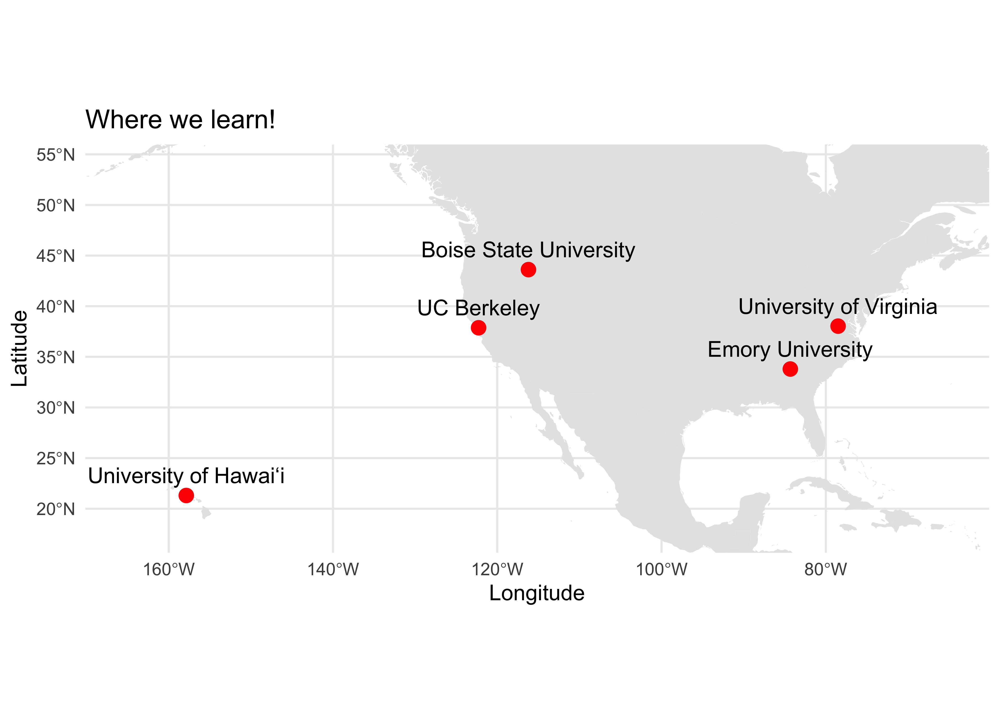

# Using Decision Making Models to Design Effective Policy for Natural Climate Solutions

## Meet our team\!

We are a [SESYNC graduate student pursuit
team](https://www.sesync.org/project/graduate-pursuits-request-for-proposals/using-decision-making-models-to-design-effective)
combining theory and data to explore multiscale drivers of agroforestry
decision-making\!

  - **Xorla Ocloo** (@xocloo): I’m a PhD candidate at Emory University and I study social-ecological systems in agroecosystems.

  - **Lauren Hunt** (@1hunt):I’m a PhD student in Human-Environment
    Systems at Boise State University. I currently study environmental
    decision-making in agriculture and I’m interested how social systems
    and individual behavior changes under the context of climate change.

  - **Katelyn Stenger** (@katelynstenger): I’m a PhD student studying
    behavioral science for sustainable systems at the University of
    Virginia’s Convergent Behavioral Science Initiative.

  - **Millie Chapman** (@milliechapman): I’m a PhD candidate in
    Environmental Science, Policy, and Management at UC Berkeley.

  - **Zoe Hastings** (@zchastings): I’m a PhD candidate at the
    University of Hawaiʻi at Mānoa in the Department of Botany.

## Description of our larger project goals:

Agroforestry is a traditional land use practice that leverages
agricultural lands as a natural climate solution (Griscom et al., 2017)
and is an integral part of numerous countries’ Nationally Declared
Contributions (NDCs) to climate mitigation and adaptation (IPCC, 2014).

Agroforestry can increase crop yields, biodiversity, and livelihood
resilience (Oakleaf et al., 2015; Minang et al., 2014). Despite these
benefits, adoption of agroforestry remains low (Kabwe et al., 2016;
Pattanayak et al., 2003). Growers who choose to adopt agroforestry must
value the long-term benefits of their management practices sufficiently
to outweigh deep uncertainties about environmental and market conditions
over long time horizons. We use agroforestry as a case study to explore
multi-scalar driving and restraining forces of decisions made for
long-term benefits under uncertainty. Our project seeks to understand
why growers adopt agroforestry by synthesizing and simulating
agroforestry adoption. We will synthesize previous research and policy
documents from Benin, Nigeria, and Cameroon to identify factors in the
decision-making space for agroforestry adoption; implement a force field
analysis to understand how factors drive or restrain agroforestry
adoption; develop a conceptual decision-making model; and integrate this
model into simulations of agroforestry adoption through time. We will
then explore the relative impact of different levers of change in the
simulation model, such as financial incentives, land tenure policies,
and risk-mitigating programs. Synthesizing and simulating the forces
that drive and restrain agroforestry adoption will inform policy design
and actionable steps for implementing agroforestry as a climate
adaptation and mitigation solution.

## Our mini-project\!

Agroforestry adoption literature largely focuses on individual decision
making,

Protected areas offer an interesting

Use the World database of protected areas:

Global Cropland dataset:

And forest cover data:

To understand how tree cover on agricultural lands in close proximity to
protected areas varies from the larger lanscape.

We will conduct a policy analysis on relevant policies within the two
nations pulling from existing policy meta-data. We aim to categories
policies by {policy type, geographic region, issued by, date in effect,
date out of effect*} *if applicable

Pending data availability, we intend to analyze the policies that
promote or hinder agroforestry adoption.

By synthesizing the measurable outcomes from remote sensing with the
presence of written policy, we will be able to show relationships
between policy interventions and agroforestry outcomes.

Our mini-project will set us up to develop our skills and succeed in
future analyses involving agroforestry, adoption, natural climate
solutions, and policy.

## What we have so far:

All data can be found in the `data` folder

All analyses are avaiilable in the `scripts` folder

## What we are hoping to learn and complete this week:

### Common files

  - `README.md` this file, a general overview of the repository in
    markdown format.

### Infrastructure for Testing

  - `DESCRIPTION` a metadata file for the repository, based on the R
    package standard. It’s main purpose here is as a place to list any
    additional R packages/libraries needed for any of the `.Rmd` files
    to run.
