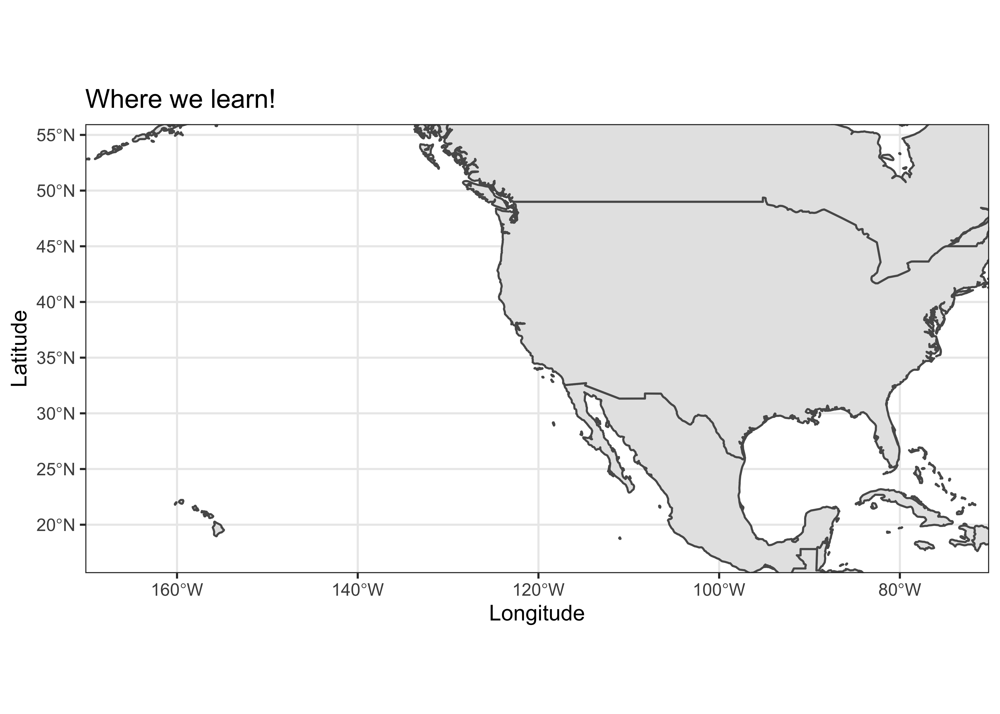

# Using Decision Making Models to Design Effective Policy for Natural Climate Solutions

## Meet our team\!

We are a [SESYNC graduate student pursuit
team](https://www.sesync.org/project/graduate-pursuits-request-for-proposals/using-decision-making-models-to-design-effective)
combining theory and data to explore multiscale drivers of agroforestry
decision-making\!

  - **Xorla Ocloo** (@xocloo):

  - **Lauren Hunt** (@1hunt):

  - **Katelyn Stenger** (@katelynstenger):

  - **Millie Chapman** (@milliechapman): I’m a PhD candidate in
    Environmental Science, Policy, and Management at UC Berkeley.

  - **Zoe Hastings** (@zchastings):

## Description of our larger project goals:

Agroforestry is a traditional land use practice that leverages
agricultural lands as a natural climate solution (Griscom et al., 2017)
and is an integral part of numerous countries’ Nationally Declared
Contributions (NDCs) to climate mitigation and adaptation (IPCC, 2014).
Agroforestry can increase crop yields, biodiversity, and livelihood
resilience (Oakleaf et al., 2015; Minang et al., 2014). Despite these
benefits, adoption of agroforestry remains low (Kabwe et al., 2016;
Pattanayak et al., 2003). Growers who choose to adopt agroforestry must
value the long-term benefits of their management practices sufficiently
to outweigh deep uncertainties about environmental and market conditions
over long time horizons. We use agroforestry as a case study to explore
multi-scalar driving and restraining forces of decisions made for
long-term benefits under uncertainty. Our project seeks to understand
why growers adopt agroforestry by synthesizing and simulating
agroforestry adoption. We will synthesize previous research and policy
documents from Benin, Nigeria, and Cameroon to identify factors in the
decision-making space for agroforestry adoption; implement a force field
analysis to understand how factors drive or restrain agroforestry
adoption; develop a conceptual decision-making model; and integrate this
model into simulations of agroforestry adoption through time. We will
then explore the relative impact of different levers of change in the
simulation model, such as financial incentives, land tenure policies,
and risk-mitigating programs. Synthesizing and simulating the forces
that drive and restrain agroforestry adoption will inform policy design
and actionable steps for implementing agroforestry as a climate
adaptation and mitigation solution.

## Our mini-project\!

Quick description of goals

## What we have so far:

All data can be found in the `data` folder

All analyses are avaiilable in the `scripts` folder

## What we are hoping to learn and complete this week:

### Common files

  - `README.md` this file, a general overview of the repository in
    markdown format.

### Infrastructure for Testing

  - `DESCRIPTION` a metadata file for the repository, based on the R
    package standard. It’s main purpose here is as a place to list any
    additional R packages/libraries needed for any of the `.Rmd` files
    to run.
