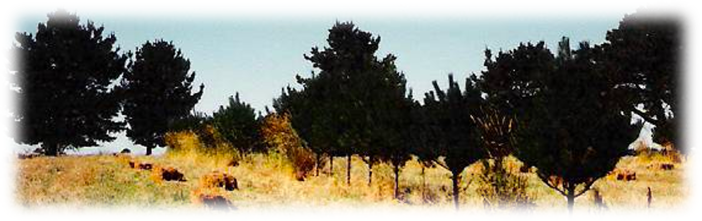
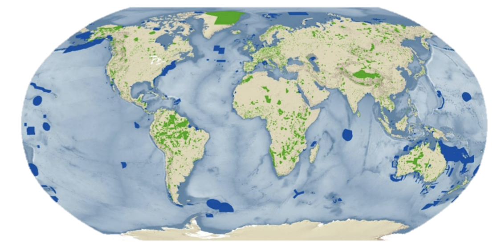
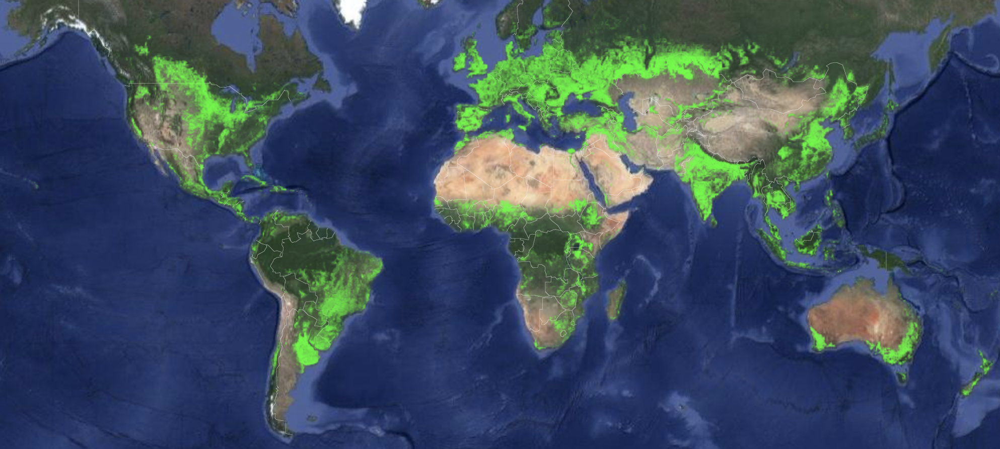

# How does conservation policy impact the distribution of agroforestry in relation to protected areas?
SESYNC Summer Institute 2020



## Our mini-project!

Agroforestry adoption literature largely focuses on individual decision making, however there are many multiscalar drivers that impact the adoption patterns of trees in production landscapes. One particularly interesting piece of this puzzle is exploring how trees in production landscapes interact with top down conservation approaches -- namely, protected areas. Meeting global targets to reduce the loss of biodiversity is going to require us to implement conservation practices in land beyond protected area boundaries. While case studies have suggested that complex  interactions  between  people,  parks,  and  trees make adoption of agroforestry  limited by policy, economics, among other factors, no studies have attempted to empiracally explore these patterns on a large scale. 


We proposed to look at how trees in agricultural landscapes around protected areas differ from those areas further afield as a result of policy surround trees in agricultural lands and protected lands. 

We utilized three global datasets as primary inputs to the spatial analysis to understand how tree cover on agricultural lands in close proximity to protected areas varies from the larger lanscape: 

(1) World database of protected areas (WDPA): 


(2) Global 30 meter resolution cropland dataset:


(3) Global 30 meter tree cover data:


# Aquiring the data!

```{r}
library(raster)
library(sf)
library(tidyverse)
library(ggplot2)
```


We started by using R to bulk download all of the africa cropland files from the NASA database. This allowed us to apply some of the fun skills from the later on lessons, and learn how to use some of the server capacities at SESYNC! 

Check it out here: `scripts/download_crop.Rmd`

But turns out 30 meter data is a bit unruly to deal with, so we decided to start small, using one tile of global forest watch and global cropland data and two countries worth of protected areas:


**Cropland**
```{r}
crop <- raster("/nfs/agroforestry-data/mini_project/GFSAD30AFCE_2015_N00E10_001_2017261090100.tif")
```

which was then reclassified to be a mask for the tree cover layer!

```{r}
#crop_mask <- reclassify(crop, cbind(0, 1.5, 0), right=FALSE)
#crop_mask<- crop_mask/2
crop_mask <- raster("/nfs/agroforestry-data/mini_project/crop_mask.tif")
plot(crop_mask)
```

**Tree cover**
```{r}
tc <- raster("/nfs/agroforestry-data/mini_project/Hansen_GFC-2019-v1.7_treecover2000_00N_010E.tif")
plot(tc)
```

We then took two countries from within those tiles from the WDPA to explore how trees in agricultural lands vary. We buffered the protected areas by 1km to allow for analysis outside of the PA

**Protected areas Cameroon**
```{r}
prot_areas_cmr <- st_read('/nfs/agroforestry-data/mini_project/cmr_pa.shp') %>%
  filter(STATUS_YR>1900)

prj <- '+proj=aea +lat_1=29.5 +lat_2=45.5+lat_0=23 +lon_0=-96 +x_0=0 +y_0=0+ellps=GRS80+towgs84=0,0,0,0,0,0,0+units=m +no_defs'

prot_areas_cmr <- st_transform(prot_areas_cmr, crs = prj)

buffer_prot_area_cmr<- st_buffer(prot_areas_cmr, 1000) 

buffer_prot_area_cmr <- st_transform(buffer_prot_area_cmr, crs = 4326)

```

```{r}
library(ggplot2)
library(maps)
buffer_prot_area_cmr %>% ggplot() +
  #geom_polygon(data=buffer_prot_area_cmr, fill='white', col='black') +
  geom_sf(aes(fill = STATUS_YR))
```


**Protected areas Nigeria**

```{r}
prot_areas_nga <- st_read('/nfs/agroforestry-data/mini_project/nga_pa.shp') %>%
  filter(STATUS_YR>1900)

prj <- '+proj=aea +lat_1=29.5 +lat_2=45.5+lat_0=23 +lon_0=-96 +x_0=0 +y_0=0+ellps=GRS80+towgs84=0,0,0,0,0,0,0+units=m +no_defs'

prot_areas_nga <- st_transform(prot_areas_nga, crs = prj)

buffer_prot_area_nga<- st_buffer(prot_areas_nga, 1000) 

buffer_prot_area_nga <- st_transform(buffer_prot_area_nga, crs = 4326)

```

```{r}
buffer_prot_area_nga %>% ggplot() +
  #geom_polygon(data=buffer_prot_area_cmr, fill='white', col='black') +
  geom_sf(aes(fill = STATUS_YR))
```


Come to find out, 30 meter resolution data can, and did, mean slightly different things for the cropland and forest cover data sets
```{r}
tc
```

```{r}
crop_mask
```

so before we could go any further we needed to resample the cropland layer to match the resolution and extent of the tree cover data

Which takes a long time to run! check out our code here: `scripts/resample_data.Rmd`. We're still working through some of the logistics to get this up and running:

(1) what resampling technique do we want to use?
(2) why do we get empty rasters sometimes?
(3) are there best practices with resampling binomial data vs. integer data?

We also got this running inn google earth engine, which will be a nice comparison for efficiency as we scale up the project!

# Analysis

Because are still working to get through resampling our data for analysis, we worked with Mary Glover on some sample data! 

We were able to set up the workflow for extracting and summarizing raster values within polygons, which we will apply to our crop and tree cover data in the future!

# Thanks!
Thanks to all the SESYNC staff for an awesome workshop! special thanks to Mary Glover for helping us through our analyses this week! 
