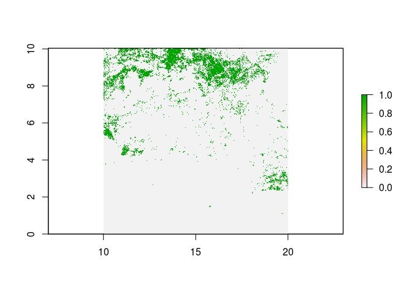
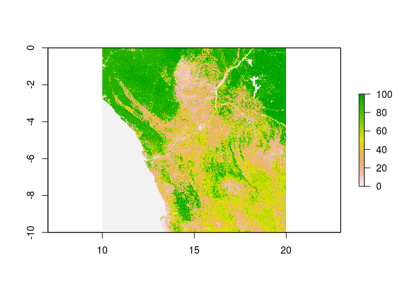
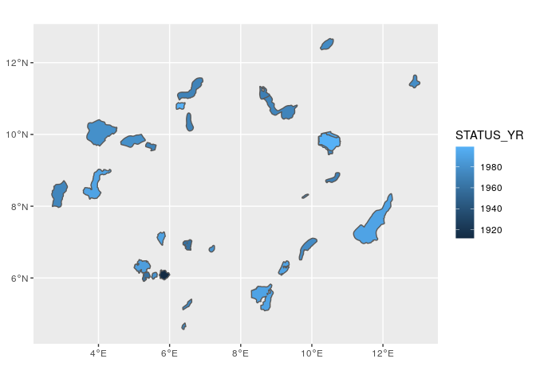
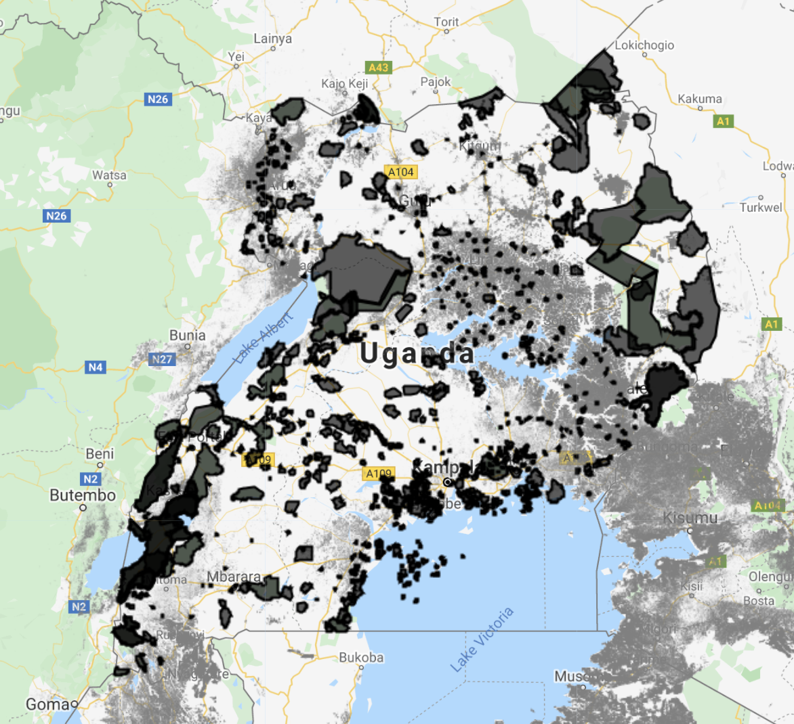

Presentation
================

# How does conservation policy impact the distribution of agroforestry in relation to protected areas?

SESYNC Summer Institute 2020


## Our mini-project\!

Agroforestry adoption literature largely focuses on individual decision
making, however there are many multiscalar drivers that impact the
adoption patterns of trees in production landscapes. One particularly
interesting piece of this puzzle is exploring how trees in production
landscapes interact with top down conservation approaches – namely,
protected areas. Meeting global targets to reduce the loss of
biodiversity is going to require us to implement conservation practices
in land beyond protected area boundaries. While case studies have
suggested that complex interactions between people, parks, and trees
make adoption of agroforestry limited by policy, economics, among other
factors, no studies have attempted to empiracally explore these patterns
on a large scale.


We proposed to look at how trees in agricultural landscapes around
protected areas differ from those areas further afield as a result of
policy surround trees in agricultural lands and protected lands.

We utilized three global datasets as primary inputs to the spatial
analysis to understand how tree cover on agricultural lands in close
proximity to protected areas varies from the larger lanscape:

1)  World database of protected areas (WDPA): 

2)  Global 30 meter resolution cropland dataset: 

3)  Global 30 meter tree cover data: 

# Aquiring the data\!

``` r
library(raster)
```

    ## Loading required package: sp

``` r
library(sf)
```

    ## Linking to GEOS 3.5.1, GDAL 2.2.2, PROJ 4.9.2

``` r
library(tidyverse)
```

    ## ── Attaching packages ────────────────────────────────────────────────────────────────────────────────────── tidyverse 1.3.0 ──

    ## ✓ ggplot2 3.3.2     ✓ purrr   0.3.4
    ## ✓ tibble  3.0.3     ✓ dplyr   1.0.0
    ## ✓ tidyr   1.1.0     ✓ stringr 1.4.0
    ## ✓ readr   1.3.1     ✓ forcats 0.5.0

    ## ── Conflicts ───────────────────────────────────────────────────────────────────────────────────────── tidyverse_conflicts() ──
    ## x tidyr::extract() masks raster::extract()
    ## x dplyr::filter()  masks stats::filter()
    ## x dplyr::lag()     masks stats::lag()
    ## x dplyr::select()  masks raster::select()

``` r
library(ggplot2)
```

We started by using R to bulk download all of the africa cropland files
from the NASA database. This allowed us to apply some of the fun skills
from the later on lessons, and learn how to use some of the server
capacities at SESYNC\!

Check it out here: `scripts/download_crop.Rmd`

But turns out 30 meter data is a bit unruly to deal with, so we decided
to start small, using one tile of global forest watch and global
cropland data and two countries worth of protected areas:

**Cropland**

``` r
crop <- raster("/nfs/agroforestry-data/mini_project/GFSAD30AFCE_2015_N00E10_001_2017261090100.tif")
```

which was then reclassified to be a mask for the tree cover layer\!

``` r
#crop_mask <- reclassify(crop, cbind(0, 1.5, 0), right=FALSE)
#crop_mask<- crop_mask/2
crop_mask <- raster("/nfs/agroforestry-data/mini_project/crop_mask.tif")
plot(crop_mask)
```

<!-- -->

**Tree cover**

``` r
tc <- raster("/nfs/agroforestry-data/mini_project/Hansen_GFC-2019-v1.7_treecover2000_00N_010E.tif")
plot(tc)
```

<!-- -->

We then took two countries from within those tiles from the WDPA to
explore how trees in agricultural lands vary. We buffered the protected
areas by 1km to allow for analysis outside of the PA

**Protected areas Cameroon**

``` r
prot_areas_cmr <- st_read('/nfs/agroforestry-data/mini_project/cmr_pa.shp') %>%
  filter(STATUS_YR>1900)
```

    ## Reading layer `cmr_pa' from data source `/nfs/agroforestry-data/mini_project/cmr_pa.shp' using driver `ESRI Shapefile'
    ## Simple feature collection with 26 features and 28 fields
    ## geometry type:  MULTIPOLYGON
    ## dimension:      XY
    ## bbox:           xmin: 8.500601 ymin: 2.104234 xmax: 16.18644 ymax: 12.17224
    ## CRS:            4326

``` r
prj <- '+proj=aea +lat_1=29.5 +lat_2=45.5+lat_0=23 +lon_0=-96 +x_0=0 +y_0=0+ellps=GRS80+towgs84=0,0,0,0,0,0,0+units=m +no_defs'

prot_areas_cmr <- st_transform(prot_areas_cmr, crs = prj)

buffer_prot_area_cmr<- st_buffer(prot_areas_cmr, 1000) 

buffer_prot_area_cmr <- st_transform(buffer_prot_area_cmr, crs = 4326)
```

``` r
library(ggplot2)
library(maps)
```

    ## 
    ## Attaching package: 'maps'

    ## The following object is masked from 'package:purrr':
    ## 
    ##     map

``` r
buffer_prot_area_cmr %>% ggplot() +
  #geom_polygon(data=buffer_prot_area_cmr, fill='white', col='black') +
  geom_sf(aes(fill = STATUS_YR))
```

<!-- -->

**Protected areas Nigeria**

``` r
prot_areas_nga <- st_read('/nfs/agroforestry-data/mini_project/nga_pa.shp') %>%
  filter(STATUS_YR>1900)
```

    ## Reading layer `nga_pa' from data source `/nfs/agroforestry-data/mini_project/nga_pa.shp' using driver `ESRI Shapefile'
    ## Simple feature collection with 952 features and 28 fields
    ## geometry type:  MULTIPOLYGON
    ## dimension:      XY
    ## bbox:           xmin: 2.66696 ymin: 4.53631 xmax: 14.28409 ymax: 13.77178
    ## CRS:            4326

``` r
prj <- '+proj=aea +lat_1=29.5 +lat_2=45.5+lat_0=23 +lon_0=-96 +x_0=0 +y_0=0+ellps=GRS80+towgs84=0,0,0,0,0,0,0+units=m +no_defs'

prot_areas_nga <- st_transform(prot_areas_nga, crs = prj)

buffer_prot_area_nga<- st_buffer(prot_areas_nga, 1000) 

buffer_prot_area_nga <- st_transform(buffer_prot_area_nga, crs = 4326)
```

``` r
buffer_prot_area_nga %>% ggplot() +
  #geom_polygon(data=buffer_prot_area_cmr, fill='white', col='black') +
  geom_sf(aes(fill = STATUS_YR))
```

<!-- -->

Come to find out, 30 meter resolution data can, and did, mean slightly
different things for the cropland and forest cover data sets

``` r
tc
```

    ## class      : RasterLayer 
    ## dimensions : 40000, 40000, 1.6e+09  (nrow, ncol, ncell)
    ## resolution : 0.00025, 0.00025  (x, y)
    ## extent     : 10, 20, -10, 0  (xmin, xmax, ymin, ymax)
    ## crs        : +proj=longlat +datum=WGS84 +no_defs +ellps=WGS84 +towgs84=0,0,0 
    ## source     : /nfs/agroforestry-data/mini_project/Hansen_GFC-2019-v1.7_treecover2000_00N_010E.tif 
    ## names      : Hansen_GFC.2019.v1.7_treecover2000_00N_010E 
    ## values     : 0, 255  (min, max)

``` r
crop_mask
```

    ## class      : RasterLayer 
    ## dimensions : 37253, 37114, 1382607842  (nrow, ncol, ncell)
    ## resolution : 0.0002694946, 0.0002694946  (x, y)
    ## extent     : 9.999058, 20.00108, -0.001077978, 10.0384  (xmin, xmax, ymin, ymax)
    ## crs        : +proj=longlat +datum=WGS84 +no_defs +ellps=WGS84 +towgs84=0,0,0 
    ## source     : /nfs/agroforestry-data/mini_project/crop_mask.tif 
    ## names      : crop_mask 
    ## values     : 0, 1  (min, max)

so before we could go any further we needed to resample the cropland
layer to match the resolution and extent of the tree cover data

Which takes a long time to run\! check out our code here:
`scripts/resample_data.Rmd`. We’re still working through some of the
logistics to get this up and running:

1)  what resampling technique do we want to use?
2)  why do we get empty rasters sometimes?
3)  are there best practices with resampling binomial data vs. integer
    data?

We also got this running in google earth engine, which will be a nice
comparison for efficiency as we scale up the project\! (see code here:
<https://code.earthengine.google.com/50a763dfb7868aaf0668a9cace73b1cb?noload=1>)

1)  GEE analysis progress 

# Analysis

Because are still working to get through resampling our data for
analysis, we worked with Mary Glover on some sample data\!

We were able to set up the workflow for extracting and summarizing
raster values within polygons, which we will apply to our crop and tree
cover data in the future.

# Thanks\!

Thanks to all the SESYNC staff for an awesome workshop\! special thanks
to Mary Glover for helping us through our analyses this week\!
